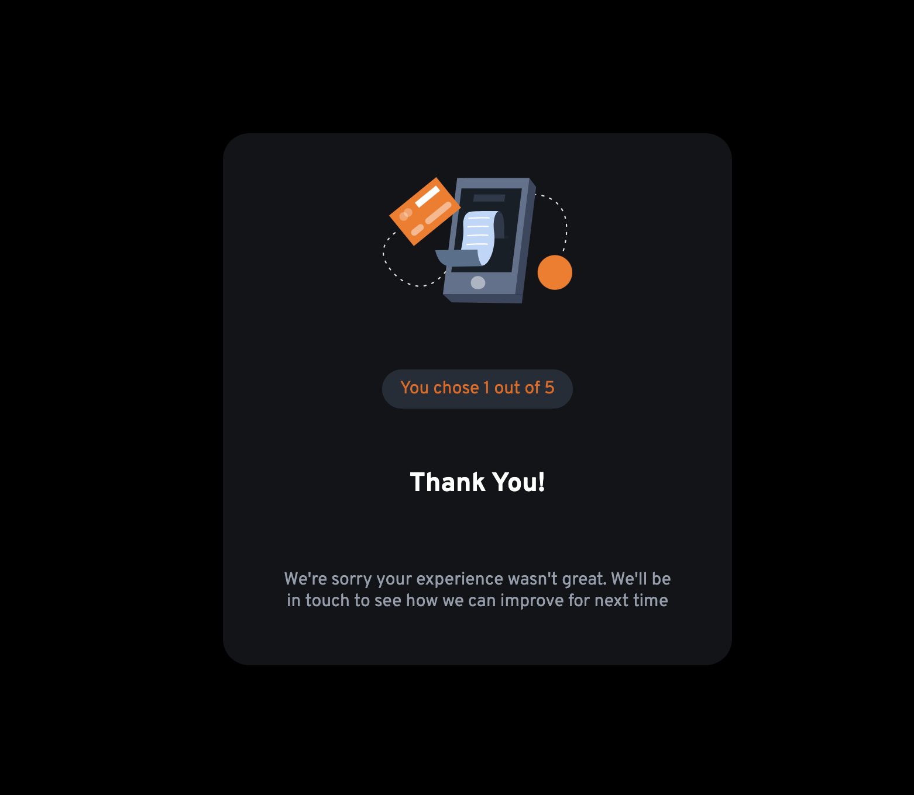
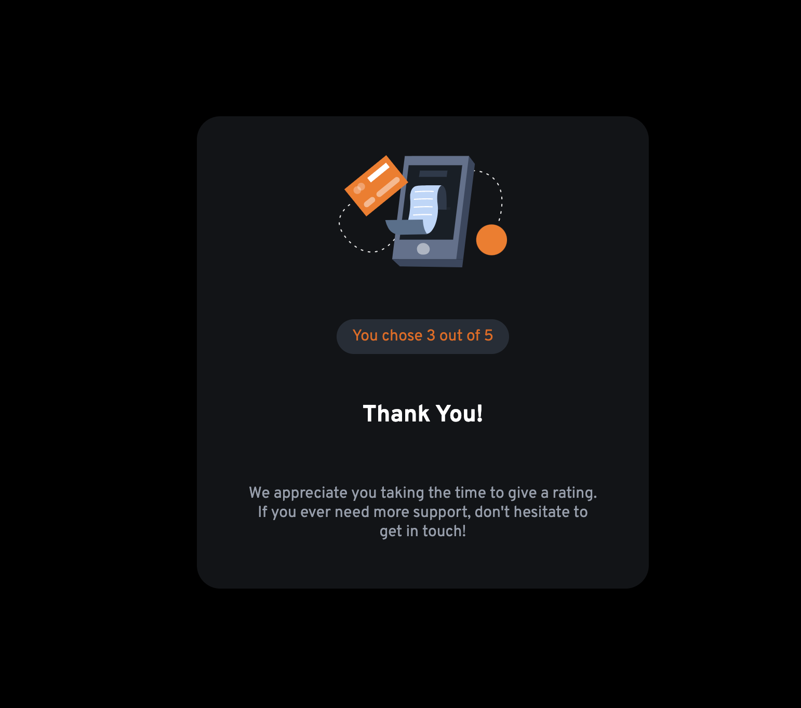

# Frontend Mentor - Interactive rating component solution

This is a solution to the [Interactive rating component challenge on Frontend Mentor](https://www.frontendmentor.io/challenges/interactive-rating-component-koxpeBUmI). Frontend Mentor challenges help you improve your coding skills by building realistic projects. 

## Table of contents

- [Overview](#overview)
  - [The challenge](#the-challenge)
  - [Screenshot](#screenshot)
  - [Links](#links)
- [My process](#my-process)
  - [Built with](#built-with)
  - [What I learned](#what-i-learned)
  - [Continued development](#continued-development)
  - [Useful resources](#useful-resources)
- [Author](#author)
- [Acknowledgments](#acknowledgments)

**Note: Delete this note and update the table of contents based on what sections you keep.**

## Overview

### The challenge

Users should be able to:

- View the optimal layout for the app depending on their device's screen size
- See hover states for all interactive elements on the page
- Select and submit a number rating
- See the "Thank you" card state after submitting a rating

### Screenshot

### Links

- Solution URL: [Add solution URL here](https://github.com/MarioLisbona/FEM-interactive-rating-component)
- Live Site URL: [Add live site URL here](https://mariolisbona.github.io/FEM-interactive-rating-component/)

## My process
I set the star logo, heading, info, rating buttons and submit buttons as their own div's inside a container div and used flex-box to align the elements. I realised at this point that i needed to make the rating buttons radio buttons so only one could be selected at a time. 

I then created the second html page using the same classes as the container for the rating page. I added the image and the thankyou message. I needed to save the value that was selected on the radio button and assign it to a variable that could be accessed on the rating result page. i used the localStorage.setItem() and localStorage.getItem() methods to save the rating variable accross multiple pages.

I then decided to display two different messages depending on what the user rating was. One message will be displayed for ratings 1 and 2. Another will be displayed for ratings 3, 4 and 5.

i animated the result card to grow from 0 to 110% andn bounce back to 100%

### Built with

- Semantic HTML5 markup
- CSS custom properties
- Flexbox

### What I learned

I learned that its easier to style radio buttons rather than style div's and have to write the logic so that one one can be selected at a time.
This was the fist time i had styled radio buttons - basically setting the input for the radio to display: none and using the label as the selector and styling the label's hover and chekced states accordingly.

I learned how to store variables that can be accessed across multiple webpages.

I learned that i needed to create a second .js file to link to the result.html page. i was initally trying to run the javascript for the second html page from the one .js file.

I used the javascript.js for the index.html and created a second result.js to populate the score (4 out of 5) field and use the rating variable.

i also used a simple if/else statement to provide a message depending on ratings 1-2 and a different message for ratings 3-5

### Continued development

This was one of the first times where iv looked at a design and started writing the html/class structure and styling the css in a straightforwad way and not really making it work by trial and error. It felt great so will keep continuing to try to improve more on this.

It was also the first time iv made something mobile responsive. So will continue to practice this important skill.

### Useful resources

- [Example resource 1](https://stackoverflow.com/questions/4641752/css-how-to-style-a-selected-radio-buttons-label) - This helped me learn how to style radio buttons.
- [Example resource 2](https://courses.webdevsimplified.com/) - This was a great online course that really helped me with learning css and becoming more comfortable with being able to confidently style pages.

## Author

- Frontend Mentor - [@MarioLisbona](https://www.frontendmentor.io/profile/MarioLisbona)

